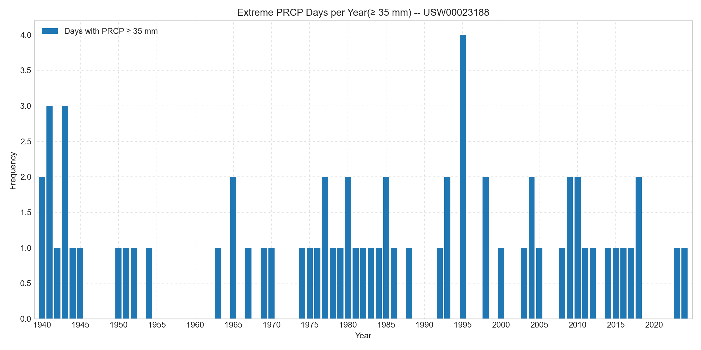

Weather Trends in San Diego — CS577 Project

Overview
This project explores long-term weather patterns in San Diego, California, using historical climate data. It was developed for CS577 to analyze temperature, precipitation, and extreme weather events through data science techniques and visual storytelling.

---

Repository Structure

WeatherTrendsInSanDiego-CS577/
- data.csv                  # Raw historical weather data
-main_analysis.ipynb       # Jupyter Notebook with full analysis and visualizations
-output/
    figures/              # Generated plots and summary CSVs
    *.png             # Visualizations (temperature, precipitation, anomalies, extremes)
    *.csv             # Summary tables and descriptive statistics
-README.md                 # Project documentation

---

Dataset
- File: data.csv  
- Contents: Daily weather observations for San Diego (temperature, precipitation, etc.)  
- Source: NOAA / course-provided  
- Format: CSV with headers, may include metadata rows  

---

Analysis Notebook 
- File: main_analysis.ipynb  
- Purpose: Performs data cleaning, statistical summaries, and visualizations  
- Key Features:
  - Annual temperature and precipitation trends
  - Diurnal temperature range (DTR) analysis
  - Extreme weather event tracking
  - Anomaly detection and normalization

---

Figures & Outputs
Located in output/figures/, this folder contains:

🔹 Visualizations (.png)
- annual_temperature_trend.png — Long-term temperature change  
- annual_precipitation.png — Yearly rainfall totals  
- annual_tmax_tmin.png — Max/min temperature comparison  
- DTR_trend.png & normalized_DTR_trend.png — Diurnal temperature range  
- extreme_temp_days.png & extreme_prcp_days.png — Frequency of extreme events  
- prcp_anomaly.png — Precipitation anomalies  
- monthly_extreme_temp_per_day.png — Monthly breakdown of extreme temperature days  
- 2020-2024_extreme_temp_heatmap.png — Recent heatmap of extreme temperatures  

🔹 Summary Tables (.csv)
- annual_summary.csv — Aggregated annual stats  
- monthly_summary.csv — Monthly averages and extremes  
- descriptive_stats.csv — Statistical overview  
- extreme_temp_days.csv — Days exceeding temperature thresholds  
- USW00023188.csv — Station-specific data  

---

Quick Preview 
Here are a few sample visualizations from the analysis:

- Annual Temperature Trend:   
- Extreme Precipitation Days:   
- DTR Trend: 

---

Setup & Usage ⚙
1. Clone the repository
bash
git clone https://github.com/FelixMarecaux/WeatherTrendsInSanDiego-CS577.git
cd WeatherTrendsInSanDiego-CS577

 2. Install dependencies
bash
pip install -r requirements.txt

3. Launch the notebook
bash
jupyter notebook main_analysis.ipynb

---

Requirements 
- pandas, numpy — data handling  
- matplotlib, seaborn — plotting  
- jupyter — notebook interface  

---

Insights 
- Warming Trend: Gradual increase in average temperatures over decades  
- Rainfall Variability: Seasonal shifts and anomaly years  
- Extreme Events: Rising frequency of heat and heavy rain days  

---

Authors 
- Felix Marecaux  
- Akil Parrish Jr.
- Isaac Reveles
